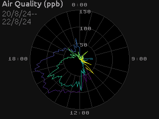

# Tempe

Beautiful, Efficient Micropython Graphics

Tempe is a graphics library designed to support everyday display and data
visualization tasks on small, 16-bit+ color screens.

- Pure Micropython codebase—no C libraries, cross-compiling or custom firmware
  needed—``mip``-install and go.
- Full 16-bit color support even on memory-constrained microcontrollers.
- API designed to support common data visualization patterns, such as polar
  coordinates, efficiently.
- Transparent support for partial display updates and damage-region tracking,
  allowing memory-efficency and fast updates for small changes.
- Core API avoids floating-point operations.
- Asyncio integration to allow simple support for dynamically changing
  graphics.

## Documentation

[Tempe Documentation](https://unital.github.io/tempe)
- [User Guide](https://unital.github.io/tempe/user_guide)
  - [Tutorial](https://unital.github.io/tempe/user_guide/tutorial)
- [API docs](https://unital.github.io/tempe/api)
- [Change Log](https://unital.github.io/tempe/changes)

## Gallery

 

 

  

## Goals

Modern micropython-based microcontrollers are surpisingly capable machines.
In particular, you can get small, inexpensive LCD or OLED screens capable of
16-bit or more color.  These can fill a role of providing users visual feedback
and simple UIs for edge computing devices: dashboards that display a device's
current state and history, or allow configuration and control of a device's
settings.  At 16-bit color depth, these should be capable of creating data
visualization and UIs which look as good as modern plotting and UI libraries.

However using these displays to their full capacity is difficult: a full-screen
framebuffer for a 320x240 display is 150K, which is a substantial fraction
of available memory on a device like a Rasperry Pi Pico.  As a result, graphics
on memory-constrained devices often ends up compromising: either by using
a smaller color palette that can fit in a smaller buffer, or by using a smaller
area of the screen for active display.

Additionally these device typically use SPI or I2C as the interface bus, so
even if there is memory to support a framebuffer, the time taken to simply
transmit the full framebuffer data to the display can take 10s of
milliseconds.

There are long-known techniques for working around these issues such as working
with smaller, partial framebuffers and doing multi-stage transfers to the
display; or tracking changes to the graphics being displayed and only updating
the damaged regions.  These can avoid compromises on graphical quality and
speed, but they either mean that the drawing code becomes complex or the
underlying graphics library needs to take care of these issues.

Tempe aims to be such a library.  It sits on top of the standard Micropython
:py:mod:`framebuf` drawing library, giving a memory-efficient API that is
particularly suited for building data visualizations, and which quietly
handles updating the screen in a way that is both memory efficient and fast.

## Design Notes

This is a graphics library designed to produce crisp, clear graphics,
subject to the following constraints:

- very restricted memory
- small screen sizes
- reduced color ranges/alpha support
- no C code and standard Micropython as much as possible
- fast rendering (aiming for <100ms for reasonable images and <1s for unreasonable images)
- integration with asyncio for events/updates

General goals are to be able to support basic UIs (eg. terminal emulation, form display)
and data visualization up to about 1000 data points, with reasonable responsiveness.

This leads to some design decisions to support generic graphical
objects well:

- use the micropython framebuf module as the underlying drawing framework
- use 16 bit color spaces (most likely RGB565, but could be greyscale or arbitrary palette)
- work in integers and screen space as much as possible (16-bit space probably fine)
- the ability to render to arbitrary regions for partial updates
- an underlying data framework that supports terse data description (eg. avoid allocating
  buffers containing simple ranges, broadcasting of values, etc.)
- a representation of geometry that is flexible and re-usable with different aesthetics
- a framework for drawing that remembers the geometry rather than regenerating from scratch
  on each re-draw
- minimizing function calls by drawing multiple similar objects in one go
- a collection of primitives sufficient for most situations
- text is the basic framebuffer text for now

Because of the possibility of weak floating-point support, full affine transforms seem
to be out of scope, but a subset of D4 x R x R2 (dihedral, scale, translate) seems
practical (although maybe not for text).

Things that this is explicitly not doing:
- a general vector drawing API, like SVG, HTML Canvas, Agg, etc.
- alpha blending (other than blit with a transparent color)

### Surfaces

A Surface is the basic canvas where shapes are drawn.  The surface is responsible for
tracking what has been drawn, what needs updating, and knows how to render a region of
itself into a raster array.

Surfaces store drawn objects in layers from 'BACKGROUND' to 'OVERLAY', with objects in
lower layers being drawn before upper ones, so that upper layers will overlay lower ones
in the screen.

Surfaces provide methods for drawing primitive shapes.

### Shapes

A shape is a drawable entity that usually consists of geometry (at a minimum a set of
locations) and additional aesthetic information (colors, etc.) that are used to generate
drawing commands on the underlying raster image.  To reduce the number of function calls,
most shapes are actually collections of the same type of object (points, rectangles,
circles, line segments, etc.) that can be drawn in a simple loop that draws data from
iterating over the geometry and aesthetics.

Shapes can be updated in-place, and know how to inform the surface that they belong to
that they have been modified and what region will need to be redrawn.

### Geometry

Geometries provide iterable sequences of values in known formats that can then be consumed
by shapes.  Geometries can be re-used by muliple shapes, and can generate derived
geometries (eg. from rectangles to the corresponding vertices) efficiently.

Because data visualizations frequently involve geometries where one or more coordinates
are repeated, either held constant over a collection of objects (such as the width of a
set of bars in a barplot) or shared between objects (such as the segment endpoints of a
polyline) there are a number of different ways to present a geometry.  For example, a
set of rectangles can most simply be presented as a sequence of (x, y, w, h) values,
but it can also be presented as a 4-tuple of sequences of xs, ys, widths and heights
which gives the opportuntiy to represent the geometric information more compactly.

These compact representations are generated by DataView objects.

### Data Views

Data views permit more compact representations of repeated or derived data as iterable
objects.  They represent a trade-off of speed vs memory: rather than storing everything
of interest in arrays of data, data views permit values to be computed on-the-fly from
other pieces of data in a consistent way.

Data views can be combined by the usual arithmetic operations, and dataviews of
inconsistent length can be lengthend vie operations such as cyclic repetition.

### Components

A component is an application-level entity that encapsulates the drawing of a related
set of shapes on a surface.  For example a line plot component would be resposible
for taking the raw data, using that to generate an appropriate geometry and aesthetic
data views, which it then uses to draw shapes onto a surface.

### Rasters

The final piece of the puzzle is the actual rendering and screen display.  A Raster is
a wrapper around a Micropython FrameBuffer that represents a visible region of a display.
When asked to render itself into a raster, the surface and shapes knows enough about the
geometry of what is being rendered that they can skip drawing objects which are ouside
the region of the raster.

The display device driver needs be able to take the data in a raster and copy it into the
corresponding region of the physical screen.

This permits devices without sufficient memory to hold a framebuffer for the entire
display to render out the display in a series of smaller chunks (eg. one quarter of the
rows at a time), and to speed up screen updates by only drawing to the regions which need
to be changed (and if the device supports windowed writing, to send the data more swiftly).

The application needs to coordinate with the surface to handle the generation of appropriate
rasters given the constraints of the application.  This might include keeping a preallocated
buffer available for use as a raster.

## Other Considerations

### Coordinates

Since we are drawing to the framebuffer, we assume all screen coordinates are signed 16-bit
integers.  Geometry values are supplied in screen coordinate values rather than floating point.

### Colors

For the time being we're assuming that the screen can handle RGB565 color, and so colors are
assumed to be unsigned 16-bit integer values, with utility routines to handle conversion to
and from more familiar formats (such as RGB888 or floating point RGB tuples).  Where we need
a key color for transparency, we will use 0b00000_000001_00000 (ie. the color with only the
least-significant green bit set).

Color maps can be extremely memory intesive, particularly if supplied as floating point rgb
values.  To save on memory, color maps should be arrays of unsigned 16-bit numbers  There are modules available that supply

### Text

The basic framebuffer 8x8 font is always available and may be acceptible for use as a plot
marker or for very small text, but professional data visualization larger and clearer fonts
are needed for display of textual information.  For the time being "font_to_py"-style fonts
seem to be an acceptible compromise between aesthetics and performance.

### Styles

For UI-like components (labels, numeric displays, etc.) it makes sense to re-use aesthetic values,
a set of aesthetic values that is used in common is a style, and applications should aim to
share styles between similar objects where possible.

