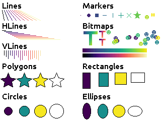

========
Tutorial
========

If you have a microcontroller with a screen capable of color graphics,
you want your applications to be able to draw to it in an efficient and
consistent way.  Micropython includes the :py:mod:`framebuf` module, which
allows you to draw into a region of memory, but even for a small screen
drawing in 16-bit color is very expensive. Additionally most of the time
you only need to update small parts of the total screen area when displayed
data changes, but a framebuffer can't track what is drawn in the region
that needs updating and so you will likely end up redrawing everything.

Basic Drawing
=============

Tempe abstracts these concerns away by providing a |Surface| object that
represents a layered 2D coordinate space, and tracks the |Shape| objects
that are drawn to it::

    surface = Surface()

    # fill the background with white pixels
    background = Rectangles([(0, 0, 320, 240)], [0xffff])
    surface.add_shape('BACKGROUND', background)

    # draw some black text in the main drawing layer
    hello_tempe = Text([(112, 116)], [0x0000], ["Hello Tempe!"])
    surface.add_shape('DRAWING', hello_tempe)

To actually render the image, you need to provide a |Display| subclass
that can handle copying a buffer to a rectangle on the physical device.
Particularly for non-standard devices or interfaces, you may need to
write this code, but there are examples of how to do this for common
displays.

You also need to provide a writable array of unsigned 16-bit integers
that Tempe can use to render raster images into before copying them to
the display.  The larger this chunk of memory is the better, but it can
be allocated once and re-used repeatedly for drawing operations.

Actual drawing is performed by calling |refresh| with the display and
the buffer::

    # a buffer one quarter the size of the screen
    working_buffer = array('H', bytearray(2*320*61))

    # set up the display object
    display = ST7789()
    display.init()

    # refresh the display
    surface.refresh(display, working_buffer)

The |refresh| method only updates the region of the screen that needs
updating (in this case, since this is the first refresh, it will be the
entire screen), and automatically handles situations where the working
buffer is too small for the size of the region which needs to be rendered.
Under the covers, it is making calls to the built-in :py:mod:`framebuf`
module to set the pixels in the working buffer for the region that is
being updated, before copying the data across to screen device.

This should display something like the following:

..  image:: hello_world.png
    :width: 160

Shapes and Geometry
===================

Tempe provides a number of fundamental |Shape| subclasses, mostly based
around what the underlying :py:mod:`framebuf` library provides: lines,
rectangles, ellipses and general polygons.

However the Tempe shape objects represent multiple instances of each of
these objects, as this permits more efficient iteration and representation
of the shapes.  For example, to draw the bars of a bar graph you might want
to draw three rectangles with three different colors, so you can call::

    bars = Rectangles(
        [(4, 4, 8, 100), (4, 16, 8, 80), (4, 28, 8, 50)],
        [red, lime, blue],
    )
    surface.add_shape('DRAWING', bars)

Where these rectangles are a related part of a larger graphical entity,
it will generally be more efficient than drawing the three rectangles
separately.

These shape objects expect to be given an appropriate |Geometry| that
describes the geometric properties of each iteration of the shapes
to be rendered.  For |Rectangles| it expects to get a |Geometry| that
can be iterated over to produce sequences of length 4, holding x, y,
width, and height, but other shapes expect different geometric information.
For example, |Circles| expect an iterator that produces x, y and radius,
while |Polygons| expect the iterator to produce :py:class:`~array.array`
instances with alternating x and y values: [x0, y0, x1, y1, x2, y2, ...].

|RowGeometry|
-------------

Tempe refers to this basic object-by-object representation of geometric
information as "row-oriented" geometry, and provides the |RowGeometry|
class as a helper.  For example, if we wanted to create a collection of
|Polygons| then rather than having to write something like::

    triangles = Polygons(
        [
            array('h', [10, 10, 10, 20, 20, 20]),
            array('h', [20, 10, 20, 20, 30, 20]),
            array('h', [30, 10, 30, 20, 40, 20]),
        ],
        [red, lime, blue],
    )

you can instead call::

    triangles = Polygons(
        RowGeometry.from_lists([
            (10, 10, 10, 20, 20, 20),
            (20, 10, 20, 20, 30, 20),
            (30, 10, 30, 20, 40, 20),
        ]),
        [red, lime, blue],
    )

which will handle creating the arrays for you.  Similarly if we were to
create the rectangles using::

    bars = Rectangles(
        RowGeometry.from_lists([
            (4, 4, 8, 100), (4, 16, 8, 80), (4, 28, 8, 50)
        ]),
        [red, lime, blue],
    )

then the data will be converted to arrays of 16-bit integers, which use
less than half as much memory.

|ColumnGeometry|
----------------

When building geometry it can sometimes be more convenient to specify
the geometrip properties in different ways than "row-oriented".  For
example, when building a horizontal bar chart, the principal information
that you are working with is a sequence of bar widths.  It's natural then
to want to build the geometry instead in a "column-oriented" fashion:
a sequence of x-values, then a sequence of y-values, then a sequence of
widths, and finally a sequence of heights.

Tempe provides a |ColumnGeometry| class for this purpose::

    xs = [4, 4, 4]
    ys = [4, 16, 28]
    widths = [100, 80, 50]
    heights = [8, 8, 8]

    bars = Rectangles(
        ColumnGeometry([xs, ys, widths, heights]),
        [red, lime, blue],
    )

When the geometry is expressed this way, we can see that there is a lot
of repetition in the columns and as we'll see when we talk about |DataView|
classes, we can take advantage of this to produce more compact and efficient
representations of the geometry.

|StripGeometry|
---------------

Another common type of data visualization is a line plot.  The |Lines|
shape expects its geometry to provide it with sets of end-point coordinates
(x1, y1, x2, y2).  So if we have data points at (10, 20), (15, 50), (20, 40),
(25, 60) and (30, 25), then to plot those with |RowGeometry| you would
need to have something like::

    line_plot = Lines(
        RowGeometry.from_lists([
            [10, 20, 15, 50],
            [15, 50, 20, 40],
            [20, 40, 25, 60],
            [25, 60, 30, 25],
        ]),
        colors=[black] * 4,
    )

It's clear that this is inefficient, as the second coordinate pair is
repeated as the first coordinate pair of the next line.  |ColumnGeometry|
is not much better unless you do clever things with :py:class:`memoryview`
objects.

In cases like this, where part of the geometry from one iteration is used
in the next, Tempe provides the |StripGeometry| class, where vertices can
simply be provided as an array of x, y values and it will generate the
appropriate sets of values for each iteration.

For example, out line plot can be written as::

    line_plot = Lines(
        StripGeometry(
            [10, 20, 15, 50, 20, 40, 25, 60, 30, 25],
            n_vertices=2,
            step=1,
        ]),
        colors=[black] * 4,
    )

Other common geometries created this way are triangle and quad strips.

|DataView| Classes
==================

Looking at the column geometry section above::

    xs = [4, 4, 4]
    ys = [4, 16, 28]
    widths = [100, 80, 50]
    heights = [8, 8, 8]

    bars = Rectangles(
        ColumnGeometry([xs, ys, widths, heights]),
        [red, lime, blue],
    )

you might notice that the ``xs`` and ``height`` values are repeated.
For three rectangles, this is not likely a problem, but if you are
plotting 100 or 1000 values, the memory use starts to add up.  In these
situations it makes sense to trade-off a lot of space for a little
computation time.

Tempe provides a number of |DataView| classes that allow data values
to be "viewed" in different ways.  For example, there is a |Repeat|
data view which creates an iterable that repeats a value over and over.

So we could instead have used::

    xs = Repeat(4)
    ys = [4, 16, 28]
    widths = [100, 80, 50]
    heights = Repeat(8)

    bars = Rectangles(
        ColumnGeometry([xs, ys, widths, heights]),
        [red, lime, blue],
    )

Similarly there are |Count| and |Range| data views that generate evenly
spaced values, and a |Cycle| data view that extends an iterable by
repeating it cyclically.  All of these data views can be used both for
|Geometry| parameters and for colors and other aesthetics::

    xs = Repeat(4)
    ys = Count(start=4, step=12)
    widths = [100, 80, 50]
    heights = Repeat(8)
    colors = Cycle([red, lime, blue])

    bars = Rectangles(
        ColumnGeometry([xs, ys, widths, heights]),
        colors,
    )

Using data views, geometries and shapes, you can quickly and efficiently
build standard data visualizations::

    def horizontal_bar_chart(
        surface,
        x, y,
        widths,
        labels,
        colors,
        bar_height=8,
    ):
        label_width = 8 * max(len(label) for label in labels)
        label_xs = Repeat(x)
        bar_xs = Repeat(x + label_width)
        ys = Count(y, bar_height)

        label_text = Text(
            ColumnGeometry([label_xs, ys], labels),
            labels,
            Repeat(black),
        )
        bars = Rectangles(
            [bar_xs, ys, widths, Repeat(bar_height)],
            colors,
        )
        surface.add_shape("OVERLAY", label_text)
        surface.add_shape("DRAWING", bars)

The High-Level API
==================

It makes sense to have a higher-level API that is more understanding of
common use-cases.

For example, so far we have been using a pattern of two-step creation of shapes, where
we first create a shape and then add it to a layer of a surface.  Since you
almost always want to add shapes to a layer immediately after creating them,
it would be useful to have a method to do this in one step.

Similarly it is common that you only want to draw one instance of a
geometry in a particular operation, and in those cases it would be nice
to avoid having to create a |Geometry| instance.  And it is often the case
that a particular set of shapes will all have the same color or other parameters,
and in those cases it is annoying to have to specify a |Repeat| data view
for every parameter.

Finally, the low-level API doesn't do any sort of sanity checking that
geometries match what is expected by the shapes, so errors occur only
when the surface attempts to draw the shape into a raster.

The |Surface| object provides this higher-level convenience API via
methods like |polygons|, |rectangles|, |circles|, and so on.  These
methods do basic sanity-checking for geometries, and for other parameters
will automatically turn single values into |Repeat| data views and do basic
conversion where it makes sense (eg. turn hex color strings into color ints).
They expect to be told which layer to use and will add the created |Shape| to
that layer.  All of these methods return the created |Shape| instance in
case other code needs to use it (eg. to apply updates later).

For example, it's common to start by applying a uniform background color
for a surface in the region that will be viewed by the display.  Up to
this point we have done this by writing something like::

    background = Rectangles(
        RowGeometry.from_lists([[0, 0, 320, 240]]),
        Repeat(colors.grey_f),
    )
    surface.add_shape("BACKGROUND", background)

Using the convenience methods, you can instead write::

    background = surface.rectangles("BACKGROUND", (0, 0, 320, 240), "#fff")

If you never plan to modify the background, you may even be able to just
write::

    surface.rectangles("BACKGROUND", (0, 0, 320, 240), "#fff")

..  note::

    As a general rule library code built on top of Tempe should still use the
    lower-level APIs, as they are more flexible and generic.  However application
    and scripting code that wants to do drawing with Tempe should use the
    higher-level convenience API in most cases.

Complex Shapes
==============

Beyond simple geometric shape classes, Tempe provides a number of more complex
shapes:

Text and Fonts
--------------

The |Text| shape handles drawing text at specified locations and colors.
By default it uses the built-in :py:mod:`framebuf` font, which is a simple
8x8 monospaced font.  It is readable and functional on a typical device,
but is not ideal for general interfaces: in particular it is available in
just one size.

For more better text rendering, Tempe currently can use bitmap fonts of the
format produced by Peter Hinch's
`font_to_py script <https://github.com/peterhinch/micropython-font-to-py>`_,
or AntiRez's `microfont library <https://github.com/antirez/microfont>`_,
as well as a slightly more efficient internal variant.  Tempe provides bitmap
versions of Google's Roboto font at 16 pt, which looks reasonably good on small
screens.

These fonts are typically shipped as modules::

    from tempe.font import TempeFont
    from tempe.fonts import roboto16bold

    font = TempeFont(roboto16bold)

    hello_tempe = Text([(64, 107)], [0x0000], ["Hello Tempe!"], font=font)
    surface.add_shape('DRAWING', hello_tempe)

Using this in the original example from the tutorial will generate something
like the following:

..  image:: hello_font.png
    :width: 160

Since the fonts are stored as bitmaps, large fonts can be expensive to load
and draw.  The font file format and tools allow you to generate font files
with only the characters you are going to use.  For example, if you are building
a digital clock display then you might create a 48-point font but with just the
digits 0-9, space and separator characters like ``:`` and ``/``.

..  warning::

    The way fonts are handled may change in the future, particularly if
    there is a vector font format that is more efficient to use.

Markers and Points
------------------

The |Points| shape expects a geometry consisting of an x, y point, the colors
for each point and what to display at each point.  This can be:

- the special constant :py:attr:`Marker.PIXEL` to draw a single pixel
- a string, which will get rendered at the location in the default framebuf font
- a :py:class:`framebuf.FrameBuffer` containing a 1-bit image
- a :py:class:`array` of 16-bit integers giving a polygon to fill

The |Markers| shape expects a geometry consisting of an x, y point and a
marker size, the colors for each marker and the shape of each marker.
The marker shapes can be specified in the same way as |Points| (which are
not scaled by size), but additionally as constants :py:attr:`Marker.CIRCLE`,
:py:attr:`Marker.SQUARE`, etc. which will be scaled according to the sizes.

Bitmaps
-------

The |Bitmaps| shape blits FrameBuffer instances at the given locations.
These must either be in RGB565 format, or supply a palette and optional
key-color for transparency.  The |ColoredBitmaps| shape render 1-bit
framebuffers in the specified colors.

Polar Geometries
----------------

..  image:: polar.png
    :width: 160
    :align: right

When working with polar plots it is common to have geometry specified by
polar ``(r, theta)`` coordinates.  For example, a donut plot consists of
multiple annular sectors whose geometry can be easily expressed as sets
of ``(r, theta, delta_r, delta_theta)`` coordinates.  To draw these, they
need to be converted to Cartesian screen coordinates and an appropriate
geometry for the shape.  A number of functions are provided in
:py:mod:`tempe.polar_geometry` to perform those conversions.  For example
:py:func:`tempe.polar_geometry.polar_rects` converts annular sectors to
polygon geometries, which can then be assigned colors and used to create
|Polygons|.

Since Tempe expects coordinates to be given as unsigned 16-bit integers,
angles are expressed as degrees.  There is no scaling performed in these
transformations, so the radial unit length is a pixel.

Concretely, to create a donut plot for a list of values, you need to work
out the start angles and angle deltas for each segment::

    values = [...]
    total = sum(values)

    proportions = [value / total for value in values]
    angles = [int(360 * sum(values[:i]) / total) for values in proportions]
    deltas = [angles[i+1] - angles[i] for i in range(len(values))]

You can then use this to create a rectangular geometry in (r, theta)
coordinates::

    segments = ColumnGeometry([
        Repeat(30),
        angles[:-1],
        Repeat(24),
        deltas,
    ])

This can then be converted to cartesian coordinates using the
:py:func:`~tempe.polar_geometry.polar_rects` function, which returns arrays
pf x, y values suitable for use as polygons or polylines::

    donut = Polygons(
        polar_rects(segments, decimation=10),
        colormap,
    )

The `decimation` parameter lets you control how coarse is the approximation
of the circular arcs by polygon lines.

Data Visualization
==================

Bringing all of this toegther, we can easily build standard data
visualizations out of the building blocks that Tempe provides.

Time Plots
----------

Microcontrollers are frequently going to read data from sensors of
various sorts, so a common need is to plot these values as they vary
over time.  Since sensors are likely to be measuring a nominally
continuous value, a time-series plot is a common visualization
that will be understood by most end-users.

Let's say that we have a collection of temperatures collected over
the last couple of days at 10 minute intervals, and their corresponding
timestamps::

    temperature = array.array('f', [14.87, 14.88, 14.79, 14.94, ... ])
    timestamps = array.array('I', [1729500000, 1729500600, 1729501200, ...])

We need to convert these to screen coordinates, so we need a basic idea
of the size of the plot and the ranges of values we want to display.  In
this data set the temperature range is from 12.09°C to 20.36°C, so a range
from 11°C to 21°C would be reasonable to encompass the data (if you were
dynamically gathering the data you would need some heuristics to choose
the range for the actual data, of course).  Our screen has a height of
240 pixels, and we want some space for titles, axes, etc. so we will use
the region from pixel row 20 to pixel row 220 for the plot.  Note that
because plots usually have the y-axis oriented upwards but raster graphics
has row 0 at the top, we have that row 20 corresponds to 21°C and row
220 corresponds to 11°C.

We can define a simple generic scaling class like::

    class LinearScale:
        """Object that maps data to screen values linearly."""

        def __init__(self, low_data, low_screen, high_data, high_screen):
            self.low_data = low_data
            self.low_screen = low_screen
            self.high_data = high_data
            self.high_screen = high_screen
            data_range = high_data - low_data
            screen_range = high_screen - low_screen
            self.scale = screen_range / data_range

        def scale_values(self, data):
            """Scale data values to screen values."""
            screen = array('h', bytearray(2*len(data)))
            low_data = self.low_data
            low_screen = self.low_screen
            scale = self.scale
            for i, value in enumerate(data):
                screen[i] = int(low_screen + scale * (value - low_data))
            return screen

and then use it to scale the temperatures::

    y = 20
    h = 200
    y1 = y + h

    temperature_scale = LinearScale(11, y1, 21, y)
    ys = scale_values(temperature)

Similarly if we want to display the last day's worth of temperatures, with
x-values ranging from 24 to 312, we get::

    x = 24
    w = 288
    x1 = x + w

    time_scale = LinearScale(1729586400, x, 1729672200, x1)
    xs = time_scale.scale_values(timestamps)

..  note::

    It's worth defining a class for this, as we will likely reuse the
    object when creating axis tick marks, labels and grid lines.

Plotting Points
~~~~~~~~~~~~~~~

Since we have aligned x and y values, we can create a geometry for the
sample points using a |ColumnGeometry|::

    points = ColumnGeometry([xs, ys])

We want constant values for color and the marker type, so we can use
``Repeat(colors.grey_3)`` to get an dark grey color for all points and
``Repeat(Marker.PIXEL)`` to mark each data point with a pixel, and then
we can display with the convenience function
:py:meth:`~tempe.surface.Surface.point`.  Because the data covers two
days but we only are showing the last, we want to make sure that the
plot is clipped to the screen region we want to use, otherwise points
will be drawn in the margins::

    surface.points(
        "DRAWING",
        points,
        Repeat(colors.grey_3),
        Repeat(Marker.PIXEL),
        clip=(x, y, w, h),
    )

This produces a visualization like this:

..  image:: line_plot_1.png
    :width: 160

Plotting Lines
~~~~~~~~~~~~~~

This is showing the data in an acceptable way (and if the data were noisier,
this might be a very good way to display it), but the data is nominally
continuous, so it would make sense to instead use a line plot to show the
data.  To draw lines, we need a geometry that produces coordinates of the
form ``(x0, y0, x1, y1)``.

We could manually do this by slicing::

    y0s = temperature_scale.scale_values(temperature[:-1])
    y1s = temperature_scale.scale_values(temperature[1:])
    x0s = time_scale.scale_values(timestamps[:-1])
    x1s = time_scale.scale_values(timestamps[1:])

    lines = ColumnGeometry([x0s, y0s, x1s, y1s])

    surface.lines(
        "DRAWING",
        lines,
        Repeat(colors.grey_3),
        clip=(x, y, w, h),
    )

This works, but it is memory-intensive, we are effectively storing the point
data twice: the cost for this dataset is small (a bit over 1K bytes), but for
larger data sets it can be substantial.  We were also sloppy in slicing the
original data, which will have created 4 temporary arrays each also about 1K
in size, but this could be avoided with clever use of :py:class:`memoryview`
objects.

But there is a better way of doing this.  The |PointsToLines| class can be
used to iterate through a point, re-using previous values.  So if we instead
do::

    points = ColumnGeometry([xs, ys])
    lines = PointsToLines(points)

    surface.lines(
        "DRAWING",
        lines,
        Repeat(colors.grey_3),
        clip=(x, y, w, h),
    )

This produces a visualization like this:

..  image:: line_plot_2.png
    :width: 160

Plot Decorations
~~~~~~~~~~~~~~~~

Now we have the data displayed, we need to put it into context so the
user can make sense of the values.  Due to the small screen sizes, care
needs to be taken to ensure that the display is legible.

We likely want to indicate to the user which parts of the screen are part
of the plot and which are not.  You can do this in a couple of ways, such as
by drawing distinct axis lines or by distinguishing the rectangle of the
plot region (eg. with a border or color change).  All are acceptable, but
whatever combination you decide you prefer you should be consistent across
all the plots in your application.

.. grid::

    .. grid-item-card:: Plot Axes

        ..  image:: line_plot_axes.png
            :width: 160

        ..  code-block::

            surface.hlines(
                'UNDERLAY',
                [(x, y1, w)],
                [colors.grey_c],
            )
            surface.vlines(
                'UNDERLAY',
                [(x, y, h)],
                [colors.grey_c],
            )

    .. grid-item-card:: Plot Border

        ..  image:: line_plot_border.png
            :width: 160

        ..  code-block::

            surface.rects(
                'BACKGROUND',
                [(x, y, w, h)],
                [colors.grey_d],
                fill=False,
            )

    .. grid-item-card:: Plot Background

        ..  image:: line_plot_bg.png
            :width: 160

        ..  code-block::

            surface.rects(
                'BACKGROUND',
                [(x, y, w, h)],
                [colors.white],
            )

    .. grid-item-card:: All Three

        ..  image:: line_plot_3.png
            :width: 160

Next you typically need some way to give the user a sense of scale for
the axes.  Because of limited screen size it is unlikely that users will
be using your plot to get precise values, but you generally do want them
to get an idea of data ranges and trends.

Common ways to give reference points for scaling are with grids and axes
ticks.  In both cases you want to take data values that you want to highlight,
map them to screen coordinates and then draw ``hlines`` or ``vlines`` as
needed.

So to draw temperature axis tick marks, you can do something like::

    tick_length = 4
    tick_temps = [12.5, 15, 17.5, 20]
    temp_marks = temperature_scale.scale_values([12.5, 15, 17.5, 20])
    surface.hlines(
        'UNDERLAY',
        ColumnGeometry([Repeat(x - tick_length), temp_marks, Repeat(tick_length)]),
        Repeat(colors.grey_c),
    )

and to draw tick labels and grid lines, you just change the geometries appropriately
to draw across the plot::

    label_temps = [15, 20]
    temp_labels = temperature_scale.scale_values([15, 20])

    surface.hlines(
        'UNDERLAY',
        ColumnGeometry([Repeat(x), temp_marks, Repeat(w)]),
        Repeat(colors.grey_f),
    )

    surface.text(
        'OVERLAY',
        ColumnGeometry([Repeat(4), temp_labels]),
        Repeat(colors.grey_a),
        [f"{t}" for t in label_temps],
    )

Finally, we can draw titles and other labels about the graph.  One note is that
there is at present no way to draw rotated text with Tempe, which can limit
options for axis titles.

Because drawing text is comparatively expensive, we want to give enough context
that the user can understand what the plot is showing.  Because the x-axis is
labelled with times, we probably don't need to label it further, and we can use
the plot title and some additional text to make it clear that this is a plot of
temperature and the wider context of time (ie. the days that the measurements
were taken).

The total result is something like this:

..  image:: line_plot_4.png
    :width: 160

Scatter Plots
-------------

..  image:: scatter_plot.png
    :width: 160

TODO: `see examples/scatter_plot_example.py <https://github.com/unital/tempe/blob/main/examples/scatter_plot_example.py>`_

Polar Plots
-----------

..  image:: polar_plot.png
    :width: 160

TODO:  `see examples/polar_plot_example.py <https://github.com/unital/tempe/blob/main/examples/polar_plot_example.py>`_

Dynamic Updates
===============

One of Tempe's design goals is to efficiently support dynamic updates
of the graphics being displayed.  |Surface| objects keep track of regions
that have changed since the last time that the surface was rendered to a
display, and when |refresh| is next called, the |Surface| will only re-draw
those regions.  All |Shape| objects know the region of the surface that they
occupy have an |update| method that applies appropriate changes to the shape
and then will tell their |Surface| that their region needs redrawing.

So the simplest possible way of updating dynamically is to always call
|refresh| immediately after calling |update|.

For example if we want to display the current time continuously, we could
do something like::

    surface = Surface()
    time_field = surface.text(
                "DRAWING",
        [[10, 10]],
        [colors.grey_a],
        [""],
        font=TempeFont(roboto32boldnumbers),
        clip=(10, 10, 240, 40),
    )
    rtc = RTC()

    while True:
        h, m, s = rtc.datetime()[4:7]
        text = f"{h:>2d}:{m:02d}:{s:02d}"
        # only update if the text has changed
        if time_field.texts[0] != text:
            time_field.update(texts=[text])
            surface.refresh(display, working_buffer)
        time.sleep(0.1)

While this works, it quickly becomes awkward once there is more than one
thing going on.  In these situations, the standard approach is to use
asyncio (Micropython's version of the Python :py:mod:`asyncio`
module).

Asyncio
-------

If you are unfamiliar with asyncio, it is worth your time to read up on
the topic.  The `documentation for Micropython asyncio <https://docs.micropython.org/en/latest/library/asyncio.html>`_
can give you a basic idea of the capabilities, but Peter Hinch's excellent
`Micropython asyncio tutorial <https://github.com/peterhinch/micropython-async/blob/master/v3/docs/TUTORIAL.md>`_
gives better practical advice (and discusses differences with Python's version of
:py:mod:`asyncio`, if you are familiar with that).

From here on we are going to assume a basic familiarity with asyncio.

Converting our previous example to work asynchronously is not too difficult.
We need to take the loop and turn it into an ``async`` function, and use
:py:func:`asyncio.sleep` instead of :py:func:`time.sleep`::

    async def update_time():
        while True:
            h, m, s = rtc.datetime()[4:7]
            text = f"{h:>2d}:{m:02d}:{s:02d}"
            # only update if the text has changed
            if time_field.texts[0] != text:
                time_field.update(texts=[text])
                surface.refresh(display, working_buffer)
            await asyncio.sleep(0.1)

This change permits python to do other things during the time that this
function is sleeping.  You can then schedule this and any other tasks that
you have using :py:mod:`asyncio.run` and :py:mod:`asyncio.gather`::

    async def main():
        await asyncio.gather(
            update_time(),
            # and other async things that you are running...
            ...
        ))

    asyncio.run(main())

This allows you to integrate Tempe drawing with typical asyncio-based code.

Event-Driven Refreshing
-----------------------

Tempe has one more trick up it's sleeve when it comes to dynamic updates:
if two regions need updating, but one is contained in the other, Tempe knows
that it only needs to worry about updating the larger region.  This saves
calls to update the display, which is moderately time-consuming.

One consequence of this is that while calling |refresh| immediately after
each |update|, it's generally better to batch |update| calls and then call
|refresh| once.

For synchronous code, this looks something like::

    while True:
        ...
        # update shapes
        time_field.update(texts=[time_text])
        temp_field.update(text=[temp_text])
        temp_plot.update(
            geometry=ColumnGeometry(
                [scale_times(times), scale_temps(temps)]
            )
        )
        ...

        # refresh display
        surface.refresh(display, working_buffer)
        time.sleep(0.1)

But for asyncio code, how do you handle multiple different tasks updating
the |Surface| independently?

Although |Surface| isn't tightly integrated with asyncio, it does have one
hook that asyncio-based code can make use of:

- when a |Shape| tells a |Surface| that a region needs updating, the
  |Surface| has an :py:class:`asyncio.Event` instance |refresh_needed|
  which it fires.
- when |refresh| is called, it resets the |refresh_needed| event.

This means that you can have an asyncio task that awaits |refresh_needed|
and then calls |refresh|::

    async def refresh_display(surface, display, working_buffer):
        while True:
            await surface.refresh_needed.wait()
            surface.refresh(display, working_buffer)

This allows you to nicely decouple the update function so all it needs
to know about is the shape(s) it works with::

    async def update_time(text_field):
        while True:
            h, m, s = rtc.datetime()[4:7]
            text = f"{h:>2d}:{m:02d}:{s:02d}"
            # only update if the text has changed
            if text_field.texts[0] != text:
                text_field.update(texts=[text])
            await asyncio.sleep(0.1)

You could similarly have a function which updates a temperature field every
second::

    async def update_temperature(text_field):
        while True:
            value = adc.read_u16()
            temp = 27 - (3.3 * value / 0xFFFF - 0.706) / 0.001721
            text = f"{temp:.1f}°C"
            # only update when needed
            if text_field.texts[0] != text:
                text_field.update(texts=[text])
            await asyncio.sleep(1)

Putting all of this together, you get a main function which looks like::

    async def main():
        ...
        await asyncio.gather(
            refresh_display(surface, display, working_buffer)
            update_time(time_field),
            update_temperature(temperature_field),
            # and other async things that you are running...
            ...
        ))

    asyncio.run(main())

..  image:: pico-tempe-updating.gif

.. |FrameBuffer| replace:: :py:class:`~framebuf.FrameBuffer`
.. |Surface| replace:: :py:class:`~tempe.surface.Surface`
.. |refresh| replace:: :py:meth:`~tempe.surface.Surface.refresh`
.. |refresh_needed| replace:: :py:attr:`~tempe.surface.Surface.refresh_needed`
.. |polygons| replace:: :py:meth:`~tempe.surface.Surface.polygons`
.. |rectangles| replace:: :py:meth:`~tempe.surface.Surface.rectangles`
.. |circles| replace:: :py:meth:`~tempe.surface.Surface.circles`
.. |Shape| replace:: :py:class:`~tempe.shapes.Shape`
.. |update| replace:: :py:meth:`~tempe.shapes.Shape.update`
.. |Rectangles| replace:: :py:class:`~tempe.shapes.Rectangles`
.. |Lines| replace:: :py:class:`~tempe.shapes.Lines`
.. |Polygons| replace:: :py:class:`~tempe.shapes.Polygons`
.. |Circles| replace:: :py:class:`~tempe.shapes.Circles`
.. |Text| replace:: :py:class:`~tempe.text.Text`
.. |Markers| replace:: :py:class:`~tempe.markers.Markers`
.. |Points| replace:: :py:class:`~tempe.markers.Points`
.. |Bitmaps| replace:: :py:class:`~tempe.bitmaps.Bitmaps`
.. |ColoredBitmaps| replace:: :py:class:`~tempe.bitmaps.ColoredBitmaps`
.. |Display| replace:: :py:class:`~tempe.display.Display`
.. |Geometry| replace:: :py:class:`~tempe.geometry.Geometry`
.. |RowGeometry| replace:: :py:class:`~tempe.geometry.RowGeometry`
.. |ColumnGeometry| replace:: :py:class:`~tempe.geometry.ColumnGeometry`
.. |StripGeometry| replace:: :py:class:`~tempe.geometry.StripGeometry`
.. |PointsToLines| replace:: :py:class:`~tempe.geometry.PointsToLines`
.. |DataView| replace:: :py:class:`~tempe.data_view.DataView`
.. |Repeat| replace:: :py:class:`~tempe.data_view.Repeat`
.. |Cycle| replace:: :py:class:`~tempe.data_view.Cycle`
.. |Count| replace:: :py:class:`~tempe.data_view.Count`
.. |Range| replace:: :py:class:`~tempe.data_view.Range`
